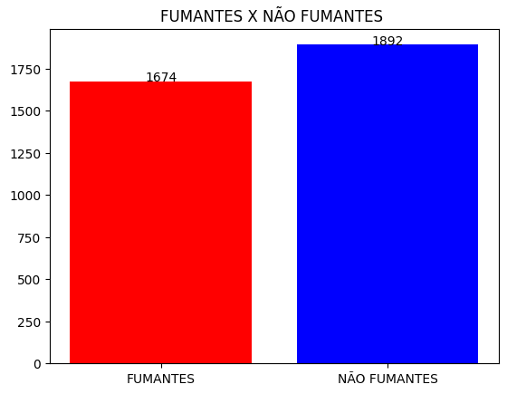
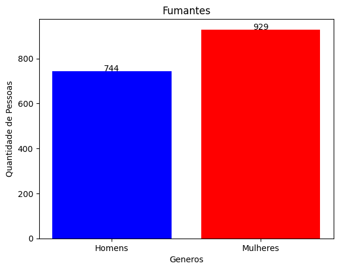
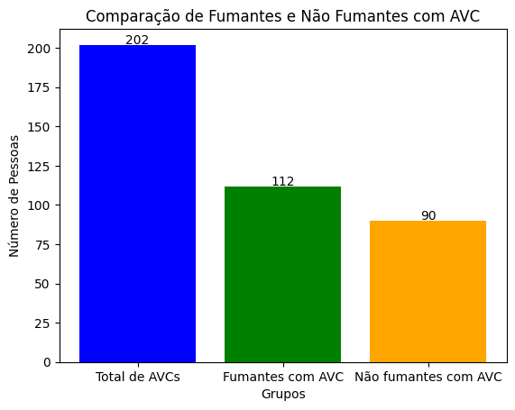

## Projeto Guiado II

 

# Tabagismo e incidencia de AVC 

Data set utilizado Conjunto de dados de previsão de AVC, site Kaggle:
https://www.kaggle.com/datasets/fedesoriano/stroke-prediction-dataset

__________________________________
 

## Sou da aréa da saúde 👩‍⚕️  e achei esse data set interresante e que poderia conter insights significativos.

 

### TABELA TRATADA COM | 3566 | (100%)

### GERAL NÃO FUMANTES | 1892 |  (53.06%)

### GERAL FUMANTES  | 1674 | (46.94%)

 

### Fiz uma comparação de genero sobre os fumantes: 

- Mulheres fumam mais que os homens;

-  Mulheres 929 | (55.50%)  

-  Homens 744 | (44.44%)

 
 
 

# Total Geral de AVCs =  202

AVC Fumantes =  112

AVC Não fumantes =  90

_______________________
 

# Comparação com os AVCs 

Total de fumantes e não fumantes e totais de AVCs 

Realizado o teste Qui-Quadrado de estatistica para comparar se o tabagismo influenciou em um aumento de AVCs.

| fumante | Sem AVC (0) | Com AVC (1) |
|---------|-------------|-------------|
| Não Fumante (0) | 1802         | 90          |
| Fumante (1)     | 1562         | 112         |

-Estatística Qui-Quadrado: 5.858167891171229

-Valor p: 0.015504925057129103

-Existe uma associação significativa 
 entre ser fumante e ter AVC.

 
 

# Criado uma consulta SQL 

#### Consulta realizada com o total dos fumantes por genero

| Gênero | Total de Fumantes |
|--------|--------------------|
| Female | 929                |
| Male   | 744                |
| Other  | 1                  |

