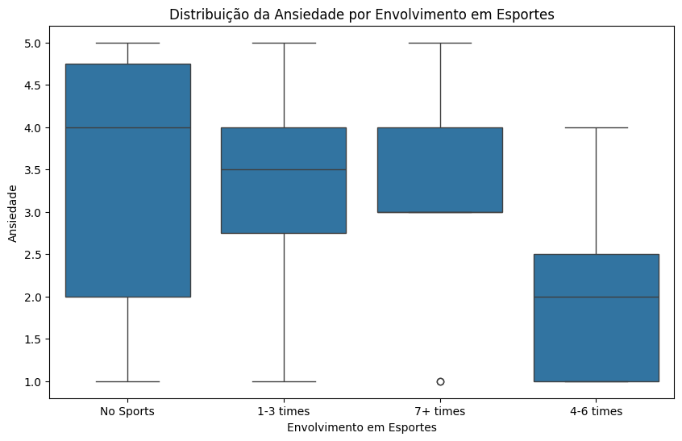

# Projeto II: Análise de Dados de Saúde Mental

## Descrição dos Dados 

O dataset utilizado neste projeto é intitulado "MentalHealthSurvey.csv" e contém informações sobre a saúde mental de estudantes universitários. As variáveis incluídas no dataset abrangem aspectos como gênero, idade, universidade, nível do curso, envolvimento em atividades esportivas, e questões relacionadas à saúde mental, como ansiedade, depressão e estresse. Além disso, o dataset inclui informações sobre atividades de alívio de estresse e preocupações financeiras, entre outras variáveis.

## Motivo da Escolha dos Dados

O motivo principal para a escolha deste dataset é a relevância crescente das questões de saúde mental no contexto acadêmico. Em um cenário onde a pressão acadêmica e o estresse são frequentemente discutidos, entender como diferentes fatores podem influenciar a saúde mental dos estudantes é crucial. 

Os dados chamaram minha atenção devido a várias razões:


## import pandas as pd 
## import matplotlib.pyplot as plt


## Instalação das Bibliotecas Necessárias

Para executar este projeto, você precisará instalar as seguintes bibliotecas Python. Você pode instalar essas bibliotecas utilizando o `pip`:

```
pip install pandas numpy matplotlib seaborn scipy sqlite3 
```

## Carregamento e Preparação dos Dados

'''import pandas as pd 
import numpy as np

# Carregar o dataset
df = pd.read_csv("MentalHealthSurvey.csv")

# Renomear colunas
df.rename(columns={
    'gender': 'genero',
    'age': 'idade',
    'university': 'universidade',
    'degree_level': 'nivel_do_curso',
    'degree_major': 'area_de_concentracao',
    'academic_year': 'ano_academico',
    'cgpa': 'média_cumulativa_pontos',
    'residential_status': 'status_residencial',
    'campus_discrimination': 'discriminacao_campus',
    'sports_engagement': 'envolvimento_esportes',
    'average_sleep': 'sono_medio',
    'study_satisfaction': 'satisfacao_estudos',
    'academic_workload': 'carga_trabalho_academica',
    'academic_pressure': 'pressao_academica',
    'financial_concerns': 'preocupacoes_financeiras',
    'social_relationships': 'relacionamentos_sociais',
    'depression': 'depressao',
    'anxiety': 'ansiedade',
    'isolation': 'isolamento',
    'future_insecurity': 'inseguranca_futuro',
    'stress_relief_activities': 'atividades_alivio_estresse'
}, inplace=True)

#Salvar o DataFrame tratado
df.to_csv('MentalHealthSurvey_tratado.csv', index=False)'''

## Visualizações e Análises 

## Qual é a distribuição de frequências das universidades no dataset? 📊

``` 
import matplotlib.pyplot as plt

plt.figure(figsize=(10, 6))
plt.hist(df['universidade'].dropna(), bins=10, color='green', edgecolor='black')

plt.title('Distribuição de Universidades')
plt.xlabel('Universidade')
plt.ylabel('Contagem')

plt.show()

```

## Como os diferentes níveis de curso estão distribuídos entre as universidades? 🎓

#Agrupar e contar as ocorrências

```
contagem = df.groupby(['universidade', 'nivel_do_curso']).size().unstack(fill_value=0)

#Configurar o gráfico
plt.figure(figsize=(10, 6))
contagem.plot(kind='bar', stacked=True, colormap='Pastel1', edgecolor='black')

plt.title('Nível do Curso por Universidade')
plt.xlabel('Universidade')
plt.ylabel('Contagem')

plt.legend(title='Nível do Curso')

plt.show()   

```


## Os estudantes relatam ter sofrido discriminação no campus? 🚸

````
#Contar as ocorrências de cada resposta (Verdadeiro ou Falso)
contagem = df['discriminacao_campus'].value_counts()

#Configurar o gráfico de pizza
plt.figure(figsize=(6, 6))
plt.pie(contagem, labels=contagem.index, autopct='%1.1f%%', colors=['lightpink', 'lightskyblue'], startangle=140)

plt.title('Distribuição de Respostas sobre Discriminação no Campus')
plt.show()

````

## Qual é a distribuição de gênero entre os estudantes no dataset? 👩‍🎓👨‍🎓


#Contar o número de homens e mulheres
n_homens = len(df[df['genero'] == 'Male'])
n_mulheres = len(df[df['genero'] == 'Female'])

#Dados para o gráfico
gêneros = ['Homens', 'Mulheres']
contagens = [n_homens, n_mulheres]

#Criar o gráfico
plt.figure(figsize=(8, 5))
plt.barh(gêneros, contagens, color=['blue', 'pink'])

#Adicionar título e rótulos
plt.title('Distribuição de Gênero no Dataset')
plt.xlabel('Número de Estudantes')
plt.ylabel('Gênero')

#Adicionar anotações com contagens
for i, valor in enumerate(contagens):
    plt.text(valor + 0.5, i, str(valor), va='center')

#Exibir o gráfico
plt.show()

# SQL

````
import sqlite3
````
## Número de Estudantes que Participam de Atividades Físicas e o Tipo de Atividades 🏋️‍♂️

````#conexão 
conn = sqlite3.connect(':memory:')
#escrever o df em uma tabela sql
df.to_sql('df', conn, index=False, if_exists='replace') 

#executar a consulta 
query_sql = """
SELECT envolvimento_esportes, COUNT(*) AS total_estudantes, GROUP_CONCAT(DISTINCT atividades_alivio_estresse) AS atividades
FROM df
GROUP BY envolvimento_esportes;
"""
crescimento_P = pd.read_sql_query(query_sql, conn)
print(crescimento_P )

#fechar a conexão
conn.close()

RESULTADO

  envolvimento_esportes  total_estudantes  \
0             1-3 times                24   
1             4-6 times                11   
2              7+ times                10   
3             No Sports                42   

                                          atividades  
0  Online Entertainment,Religious Activities, Spo...  
1  Sports and Fitness, Creative Outlets, Online E...  
2  Religious Activities, Sports and Fitness, Soci...  
3  Religious Activities, Social Connections, Onli...  


````

## Média de Ansiedade e Depressão por Nível de Curso 📈

````
#conexão 
conn = sqlite3.connect(':memory:')
#escrever o df em uma tabela sql
df.to_sql('df', conn, index=False, if_exists='replace') 

#executar a consulta 
query_sql = """
SELECT nivel_do_curso, AVG(ansiedade) AS media_ansiedade, AVG(depression) AS media_depressao
FROM df
GROUP BY nivel_do_curso;
"""
crescimento_P = pd.read_sql_query(query_sql, conn)
print(crescimento_P )

#fechar a conexão
conn.close()

RESULTADO
  nivel_do_curso  media_ansiedade  media_depressao
0   Postgraduate         3.500000              4.0
1  Undergraduate         3.211765              3.2

````
# Há uma diferença significativa nos níveis de ansiedade entre estudantes que praticam atividades físicas (envolvimento em esportes) e aqueles que não praticam?
🤔🤔🤔🤔🤔🤔🤔🤔🤔🤔🤔🤔🤔🤔🤔🤔🤔🤔🤔🤔🤔🤔🤔🤔🤔🤔🤔🤔🤔🤔🤔🤔🤔🤔🤔🤔🤔🤔🤔🤔🤔🤔🤔🤔🤔🤔




````
Estatística t: -1.4691467730618726
Valor p: 0.1454844501013555
Falhamos em rejeitar a hipótese nula. Não há uma diferença significativa na ansiedade entre estudantes que fazem atividades físicas e aqueles que não fazem.

````